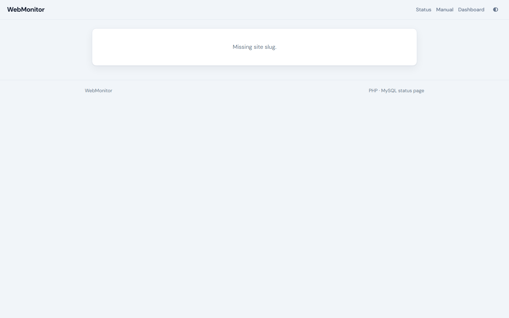

# WebMonitor (PHP + MySQL)

Simple uptime monitor — **HTML, CSS, JavaScript, PHP, MySQL only**.

## Screenshots

### Sign in


### User manual


### Public status


### Dashboard


### Websites


### Add website


### Logs


### Settings


### Status site



## Setup (XAMPP or shared hosting)

1. Create a MySQL database and user.
2. Edit `api/.env`:

```env
DB_HOST=localhost
DB_PORT=3306
DB_NAME=your_db
DB_USER=your_user
DB_PASS=your_password
APP_URL=https://your-domain.com/Webmonitor
COOKIE_SECURE=true
```

3. Import `database/schema.sql` in phpMyAdmin.
4. Seed users:

```bash
php cli/seed.php
```

5. Open `/Webmonitor/login.php`  
   Admin: `admin@webmonitor.local` / `ChangeMe123!`

6. Optional cron (every minute):

```bash
php /path/to/Webmonitor/cli/monitor.php
```

## Pages

| URL | Purpose |
|-----|---------|
| `login.php` | Sign in |
| `dashboard.php` | Overview + run checks |
| `websites.php` | Manage monitors |
| `status.php` | Public status page |
| `health.php` | JSON DB health |
| `db-check.php?key=setup` | Temporary DB debugger (delete after setup) |

## Folders

- `lib/` — Env, DB, Auth, Monitor helpers
- `includes/` — bootstrap + layout
- `assets/` — CSS + JS
- `cli/` — seed + monitor cron
- `database/` — SQL schema
- `portal/` — optional links portal (separate)

Node / React / Prisma under `frontend/` and `backend/` are **not required** to run this app.
