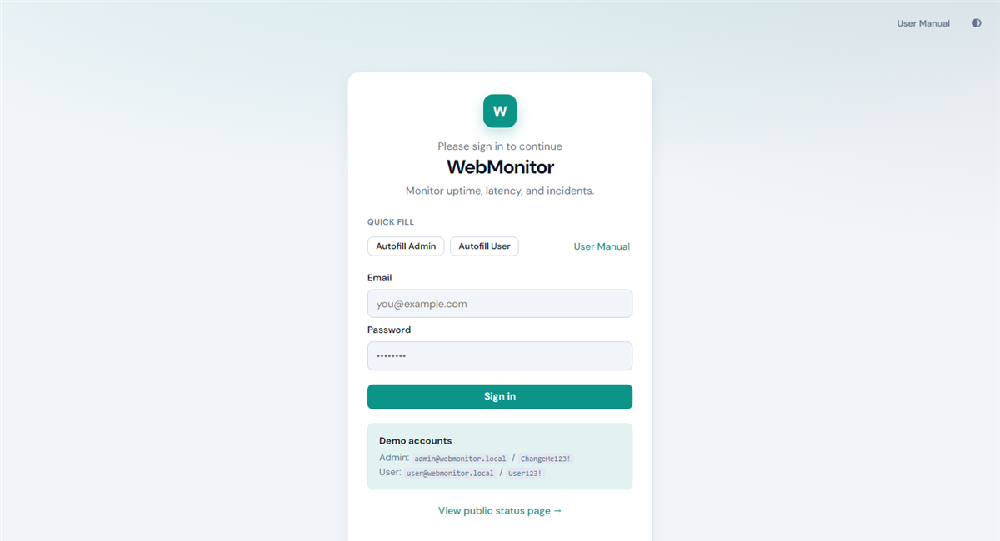
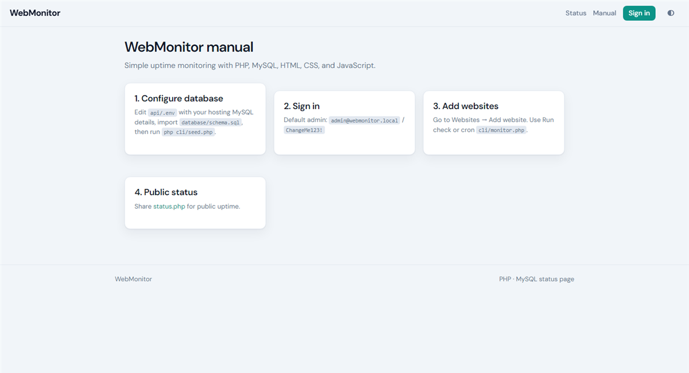
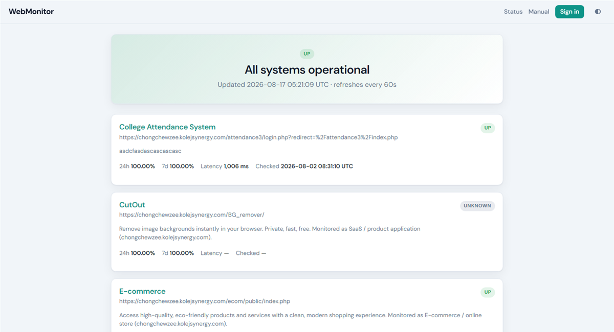
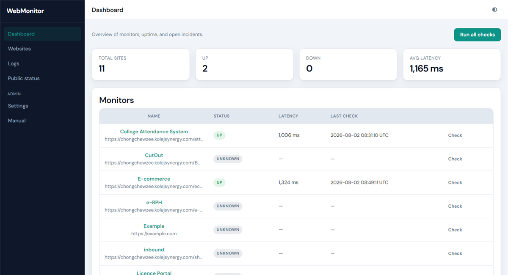
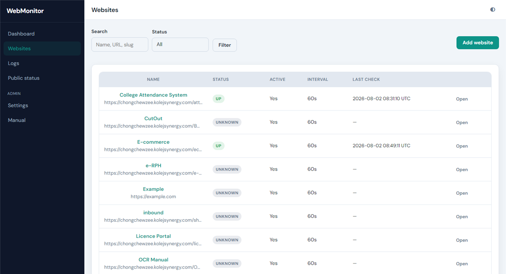
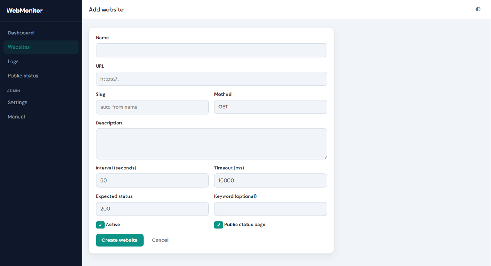
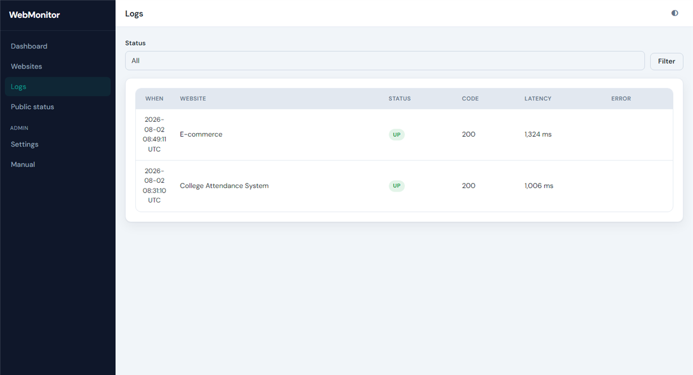
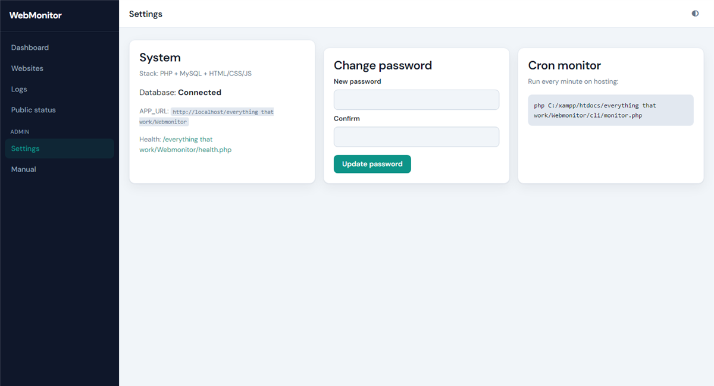

# WebMonitor (PHP + MySQL)

Simple uptime monitor — **HTML, CSS, JavaScript, PHP, MySQL only**.

## Screenshots

### Sign in



### User manual



### Public status



### Dashboard



### Websites



### Add website



### Logs



### Settings



---

## What you need

- XAMPP (Apache + MySQL + PHP)
- PHP CLI for the seed script (`php`)

## Step-by-step setup

1. Install XAMPP and start **Apache** and **MySQL**.
2. Clone into `htdocs`:
   ```bash
   cd C:\xampp\htdocs
   git clone https://github.com/chewzees/Webmonitor.git
   ```
3. Create a MySQL database named `webmonitor` (phpMyAdmin → New).
4. Import `database/schema.sql` into that database.
5. Copy settings into `api/.env` (create it if missing):

```env
DB_HOST=127.0.0.1
DB_PORT=3306
DB_NAME=webmonitor
DB_USER=root
DB_PASS=
APP_URL=http://localhost/Webmonitor
COOKIE_SECURE=false
ADMIN_EMAIL=admin@webmonitor.local
ADMIN_PASSWORD=ChangeMe123!
```

If the folder is nested, set `APP_URL` to the real path, for example  
`http://localhost/everything that work/Webmonitor`

6. Seed demo users:
   ```bash
   cd C:\xampp\htdocs\Webmonitor
   php cli/seed.php
   ```
7. Open:
   `http://localhost/Webmonitor/login.php`

## Step-by-step usage

1. On login, click **Autofill Admin** or enter `admin@webmonitor.local` / `ChangeMe123!`.
2. Click **Sign in**.
3. On **Dashboard**, run checks and read uptime/latency.
4. Open **Websites** → **Add** (`website-form.php`), enter a URL and interval, save.
5. Open **Logs** for check history.
6. Open **Settings** for account/app options.
7. Share **status.php** as the public status page (no login).
8. Read **manual.php** for the in-app guide.
9. Optional cron every minute:
   ```bash
   php C:\xampp\htdocs\Webmonitor\cli\monitor.php
   ```

Demo user: `user@webmonitor.local` / `User123!`

## If something goes wrong

- **Database is not connected:** `api/.env` path/credentials, and MySQL must be running.
- **Redirects to `/Webmonitor` 404:** set `APP_URL` to the folder you actually opened.
- Node / React under `frontend/` and `backend/` are **not** required.

## Pages

| URL | Purpose |
|-----|---------|
| `login.php` | Sign in |
| `dashboard.php` | Overview + run checks |
| `websites.php` | Manage monitors |
| `status.php` | Public status page |
| `health.php` | JSON DB health |
